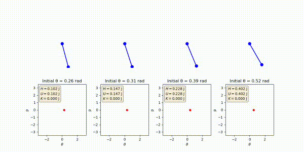

# Symplectic Spectrum Gaussian Processes (2022 Tanaka, Iwata & Ueda)

## Part 1: Description of the System

### Virtual Model of Pendulum System

The system under consideration is a simple pendulum. The schematic provided below describes its configuration. Key parameters of the pendulum include:

- **Length of the string, $l$** (in meters): This is the distance from the pivot point to the mass.
- **Mass at the end of the string, $m$** (in kilograms): This is the weight suspended by the string.
- **Gravitational constant, $g$** (in meters per second squared): This is the acceleration due to Earth's gravity, affecting the pendulum's motion.

The state of the pendulum is defined by the angle $\theta$, which measures the deviation of the string from the vertical axis, and the conjugate momenta $p_{\theta}$, representing the momentum associated with the angular position.

    

#### Forming the Lagrangian

The Lagrangian $\mathcal{L}$ of a system is a function that summarizes the dynamics of the system. It is defined as the difference between the kinetic energy $T$ and the potential energy $V$ of the system:
$$
\mathcal{L} = T - V
$$

##### Kinetic Energy $T$
For a simple pendulum, which consists of a mass $m$ at the end of a rod of length $l$ swinging under gravity, the kinetic energy is derived from the motion of the mass along a circular path. The velocity $v$ of the mass is given by $l\dot{\theta}$, where $\dot{\theta}$ is the angular velocity. Hence, the kinetic energy $T$ is:
$$
T = \frac{1}{2} m v^2 = \frac{1}{2} m (l\dot{\theta})^2 = \frac{1}{2} ml^2\dot{\theta}^2
$$

##### Potential Energy $V$
The potential energy $V$ is due to the height of the mass from a reference level, which we can take as the lowest point of the pendulum's path. If $\theta = 0$ represents the lowest point, the height $h$ of the mass is $l - l\cos(\theta)$. Thus, the potential energy $V$ due to gravity is:
$$
V = mgh = mg(l - l\cos(\theta)) = mgl(1 - \cos(\theta))
$$

##### The Lagrangian
By combining these expressions for $T$ and $V$, the Lagrangian $\mathcal{L}$ is:
$$
\mathcal{L} = \frac{1}{2}ml^2\dot{\theta}^2 - mgl(1 - \cos\theta)
$$

#### Deriving the Hamiltonian

The Hamiltonian $\mathcal{H}$ is derived from the Lagrangian through a transformation involving the conjugate momentum. The conjugate momentum $p_\theta$ corresponding to the coordinate $\theta$ is defined as:
$$
p_{\theta} = \frac{\partial\mathcal{L}}{\partial\dot{\theta}} = ml^2\dot{\theta}
$$

##### Hamiltonian $\mathcal{H}$
The Hamiltonian $\mathcal{H}$ is given by:
$$
\mathcal{H} = \sum_{\theta} \dot{\theta}p_{\theta} - \mathcal{L}
$$

For the simple pendulum with only one generalized coordinate $\theta$, this becomes:
$$
\mathcal{H} = \dot{\theta}p_{\theta} - \mathcal{L}
$$
Substituting the expressions for $\mathcal{L}$ and $p_{\theta}$, and rewriting $\dot{\theta}$ in terms of $p_{\theta}$:
$$
\mathcal{H} = \dot{\theta}(ml^2\dot{\theta}) - \left(\frac{1}{2}ml^2\dot{\theta}^2 - mgl(1 - \cos\theta)\right)
$$
$$
\mathcal{H} = \frac{p_{\theta}^2}{2ml^2} + mgl(1 - \cos\theta)
$$

The formulation and transformation from the Lagrangian to the Hamiltonian are thus complete. This transition provides a powerful way to analyze the system in terms of energy rather than forces, which can be particularly useful in complex systems and in the field of quantum mechanics.

#### Simple Demo of the Pendulum System and its Phase Space
In our example, we will fix $m=1kg$, $l=1m$, and $g=3m/s^2$. 

This gives us the hamiltonian
$$
H(\theta, p_{\theta}) = \frac{p_{\theta}^2}{2} + 3(1 - \cos\theta).
$$
Some example trajectories are shown below.

    

### Problem Objective

The goal of this problem is to infer the unknown Hamiltonian of a pendulum system using observational data collected through a series of experiments. In each experiment, a lab technician sets a pendulum at a specified initial angle $\theta$ and imparts a specific momentum $p_{\theta}$. The pendulum is then released and its motion is recorded for $T$ seconds, capturing $J$ frames at regular intervals. These frames are used to estimate the state $(\theta, p_{\theta})$ at each point, albeit with some noise introduced by the limitations of camera-based measurements.

Our objective is to develop a probabilistic model that accurately represents the Hamiltonian function of the pendulum, which depends on $(\theta, p_{\theta})$. This model is derived directly from the noisy data of $I$ experiments. Upon successful training, the model’s efficacy is verified by predicting the pendulum’s behavior under new, untested initial conditions.

**Evaluation of Model Performance**

The effectiveness of the model is determined by its ability to predict future states of the pendulum given some initial conditions. Specifically, a well-performing model should satisfy the following criteria:

1. **Calibration:** The model should provide well-calibrated predictions. For a predicted distribution $D(\theta, p_{\theta})$, empirical validation should show that the probability $p(\theta_L \leq \theta \leq \theta_U, p_{\theta,L} \leq p_{\theta} \leq p_{\theta,U})$ closely matches the observed frequency $\frac{1}{N} \sum_{i=1}^N \mathbb{1}(\theta_L \leq \tilde{\theta} \leq \theta_U, p_{\theta,L} \leq \tilde{p_{\theta}} \leq p_{\theta,U})$, where $(\tilde{\theta}, \tilde{p_{\theta}})$ are the test observations.

2. **Variance Reduction:** The variance of the predicted distribution $D(\theta, p_{\theta})$ should be minimized, indicating precise and consistent predictions.

#### Why are we learning the Hamiltonian?
We're doing this because we can use the Hamiltonian to predict the future state of the pendulum system given some initial conditions. Consider the generalized coordinates $\mathbf{x}=(\mathbf{x}_q, \mathbf{x}_p)$. Then Hamiltonian dynamics tells us that:
$$
\begin{align*}
\frac{d \mathbf{x}}{d t} &= (\mathbf{S}-\mathbf{R}) \nabla H(\mathbf{x}) =: \mathbf{f}(\mathbf{x}), \quad \text{where} \quad \mathbf{S} = \begin{pmatrix} \mathbf{0} & \mathbf{I} \\ -\mathbf{I} & \mathbf{0} \end{pmatrix}\\
\end{align*}
$$
where $\mathbf{R}$ is a positive semi-definite dissipation matrix. When $\mathbf{R}=\boldsymbol{0}$, the vector field conserves total energy and has a symplectic geometric structure. The form of $\mathbf{R}$ below representes a dissipation system with friction coefficients $r_i \ge 0$:
$$
\mathbf{R} = \begin{pmatrix} \mathbf{0} & \mathbf{0} \\ \mathbf{0} & diag(\mathbf{r}) \end{pmatrix}
$$

After simplifying the above, we get the dynamics of the generalized coordinates:
$$
\begin{align*}
 \frac{d \mathbf{x}_q}{d t} &= \nabla_{\mathbf{x}_p}H(\mathbf{x}) \\
\frac{d \mathbf{x}_p}{d t} &= -\nabla_{\mathbf{x}_q}H(\mathbf{x}) - diag(\boldsymbol{r})\cdot \nabla_{\mathbf{x}_p}H(\mathbf{x})
\end{align*}
$$

We can use these to predict the state of the system at any future point in time:
$$
\begin{align*}
\mathbf{x}(t)&=\mathbf{x}_{1}+\int_{t_{1}}^{t} \mathbf{f}(\mathbf{x}) d t.
\end{align*}
$$

**EXAMPLE: PENDULUM SYSTEM**
For the pendulum system with friction coefficient $r$, this is
$$
\begin{align*}
\begin{pmatrix} \frac{d \theta}{d t} \\ \frac{d p_{\theta}}{d t} \end{pmatrix} &= \begin{pmatrix} 0 & 1 \\ -1 & -r \end{pmatrix} \cdot \begin{pmatrix} \frac{\partial H(\theta,p_{\theta})}{\partial \theta} \\ \frac{\partial H(\theta,p_{\theta})}{\partial p_{\theta}} \end{pmatrix} = \mathbf{f}(\theta, p_{\theta})\\
\Rightarrow \frac{d \theta}{d t} &= \frac{\partial H(\theta,p_{\theta})}{\partial p_{\theta}} \\
\Rightarrow \frac{d p_{\theta}}{d t} &= -\frac{\partial H(\theta,p_{\theta})}{\partial \theta} - r\frac{\partial H(\theta,p_{\theta})}{\partial p_{\theta}} \\
\Rightarrow \begin{pmatrix} \theta \\ p_{\theta} \end{pmatrix}(t) &=\begin{pmatrix} \theta \\ p_{\theta} \end{pmatrix}(t_0) +\int_{t_{0}}^{t} \mathbf{f}(\theta, p_{\theta}) d t
\end{align*}
$$

Using the form of pendulum systems Hamiltonian derived above
$$
\mathcal{H} = \frac{p_{\theta}^2}{2ml^2} + mgl(1 - \cos\theta)
$$
we can calcuate the state dynamics as 
$$
\begin{align*}
\frac{d \theta}{d t} &= \frac{\partial H(\theta,p_{\theta})}{\partial p_{\theta}} \\
&= \frac{p_{\theta}}{ml^2}\\
\frac{d p_{\theta}}{d t} &= -\frac{\partial H(\theta,p_{\theta})}{\partial \theta} - r\frac{\partial H(\theta,p_{\theta})}{\partial p_{\theta}} \\
&= -mgl \sin (\theta) - r\frac{p_{\theta}}{ml^2}
\end{align*}
$$

This gives us
$$
\begin{align*}
\mathbf{f}(\theta, p_{\theta}) = \begin{pmatrix}
\frac{p_{\theta}}{ml^2} \\ -mgl \sin (\theta) - r\frac{p_{\theta}}{ml^2}
\end{pmatrix}
\end{align*}
$$

### Real-World Dataset of Pendulum System

The dataset consists of $I$ noisy trajectories represented by the series $\left\{\left(t_{ij}, \mathbf{y}_{ij}\right)\right\}$, where $i=1, \ldots, I$ and $j=1, \ldots, J_i$. Each trajectory is made up of $J_i$ observations over time. We define $\mathbf{x} = (\theta, p_{\theta})$ as the state variables of the pendulum, where $\theta$ is the angle and $p_{\theta}$ is the conjugate momentum.

Each observed state $\mathbf{y}_{ij}$ is a noisy measurement of the true state $\mathbf{x}(t_{ij})$ at time $t_{ij}$, modeled as:

$$
\mathbf{y}_{ij} = \mathbf{x}(t_{ij}) + \epsilon_{ij},
$$

where $\epsilon_{ij}$ represents the observational noise. This noise is assumed to follow a specific known probability distribution, $p(\epsilon)$.

The dataset visualization below displays these trajectories for the entire training dataset. Colors in the plot distinguish individual trajectories from one another.

    

## Part 2 and 3: Numerical Method

### Step 0: Collect the data. 

$$
\begin{align*}
    &\mathbf{x}=(\theta, p_{\theta}) \quad \text{(generalized coordinates)} \\
    &\left\{\left(t_{ij}, \mathbf{y}_{ij}\right)\right\}_{i=1}^{I}, j=1, \ldots, J_i  \quad \text{($I$ noisy trajectories, each with $J_i$ observations)} \\
    &\mathbf{y}_{ij} = \mathbf{x}_{ij}  + \boldsymbol{\epsilon}_{ij} \quad \text{(noise model)}\\
    &\boldsymbol{\epsilon}_{ij} \sim p(\boldsymbol{\epsilon}_{ij}) \quad \text{where} \quad p(\boldsymbol{\epsilon}_{ij}) = \mathcal{N}(\boldsymbol{0}, \sigma^2 \mathbf{I})
\end{align*}
$$

In our example problem, $\mathbf{x}=(\theta, p_{\theta})$ are the generalized coordinates. We observe the pendulum system under 50 different initial conditions $\mathbf{x}_{j0}$, and make 16 equidistant observations in time over the period of 3 seconds. 

### Step 1: Gaussian Process Prior Symplectic Vector Field

In the proposed model, the unknown Hamiltonin $H(\mathbf{x})$ is assumed to be a single-output GP with zero mean. Let $\mathcal{L} := (\mathbf{S} - \mathbf{R}) \nabla_{\mathbf{x}}$ denote a differential operator, where $\nabla_{\mathbf{x}}$ is the gradient with respect to $\mathbf{x}$. Then
$$
\mathbf{f}(\mathbf{x}) = \mathcal{L} H(\mathbf{x}), \quad \text{where} \quad H(\mathbf{x}) \sim \mathcal{GP}\left(0, k(\mathbf{x}, \mathbf{x}')\right)
$$
Here, $k(\mathbf{x}, \mathbf{x}') : \mathbb{R}^{D} \times \mathbb{R}^{D} \rightarrow \mathbb{R}$ is a covariance function. Since differentiation is a linear operator, the derivative of a GP is also a GP:
$$
\mathbf{f}(\mathbf{x}) \sim \mathcal{GP}\left(\mathbf{0}, \mathbf{K}(\mathbf{x}, \mathbf{x}')\right)
$$
where $\mathbf{0}$ is a column vector of zeros, and $\mathbf{K}(\mathbf{x}, \mathbf{x}') : \mathbb{R}^{D} \times \mathbb{R}^{D} \rightarrow \mathbb{R}^{D \times D}$ is the matrix-valued covariance function represented by
$$
\begin{align*}
\mathbf{K}(\mathbf{x}, \mathbf{x}') &= E_{\mathbf{x}} \left[ (\mathbf{S} - \mathbf{R}) \nabla_{\mathbf{x}} H(\mathbf{x}) \nabla_{\mathbf{x}'} H(\mathbf{x}')^{\top} (\mathbf{S} - \mathbf{R})^{\top} \right]  \\
&= (\mathbf{S} - \mathbf{R}) E_{\mathbf{x}} \left[ \nabla_{\mathbf{x}} H(\mathbf{x}) \nabla_{\mathbf{x}} H(\mathbf{x}')^{\top} \right] (\mathbf{S} - \mathbf{R})^{\top} \\
&= (\mathbf{S} - \mathbf{R}) \nabla^2 E_{\mathbf{x}} \left[ H(\mathbf{x}) H(\mathbf{x}')^{\top} \right] (\mathbf{S} - \mathbf{R})^{\top} \\
&= (\mathbf{S} - \mathbf{R}) \nabla^2 k(\mathbf{x}, \mathbf{x}') (\mathbf{S} - \mathbf{R})^{\top} \\
\end{align*}
$$

where $\nabla^2$ is the Hessian operator.

---
**Exampe**
Consider the pendelum system with friction coefficient $r$, and the following GP prior:
$$
\begin{align}
H(\theta, p_{\theta}) &\sim \mathcal{GP}\left(\mathbf{0}, k\left((\theta, p_{\theta}), (\theta', p_{\theta}')\right)\right)\\
k\left((\theta, p_{\theta}), (\theta', p_{\theta}')\right)&=\sigma_{0}^{2} \exp \left(-\frac{1}{2}\left(\begin{pmatrix} \theta \\ p_{\theta}\end{pmatrix}-\begin{pmatrix} \theta \\ p_{\theta}\end{pmatrix}^{\prime}\right)^{\top} \boldsymbol{\Lambda}^{-1}\left(\begin{pmatrix} \theta \\ p_{\theta}\end{pmatrix}-\begin{pmatrix} \theta \\ p_{\theta}\end{pmatrix}^{\prime}\right)\right) \\
\boldsymbol{\Lambda}&=\operatorname{diag}\left(\lambda_{1}^{2}, \lambda_{2}^{2}\right), \quad \sigma_{0}^{2} \in \mathbb{R}_{>0}, \quad \lambda_{d}^{2} \in \mathbb{R}_{>0}
\end{align}
$$
and
$$
\begin{align}
\mathbf{f}\left(\theta, p_{\theta}\right) &\sim \mathcal{GP}\left(\mathbf{0}, \mathbf{K}\left((\theta, p_{\theta}), (\theta', p_{\theta}')\right)\right) \\
\mathbf{K}\left((\theta, p_{\theta}), (\theta', p_{\theta}')\right) & = \begin{pmatrix} 0 & 1 \\ -1 & -r \end{pmatrix} \cdot \nabla^2 \cdot \begin{pmatrix} 0 & -1 \\ 1 & -r \end{pmatrix}\cdot k\left((\theta, p_{\theta}), (\theta', p_{\theta}')\right)
\end{align}
$$

Then given a sample $\mathbf{f}\left(\theta, p_{\theta}\right)$, we can predict the future state via symplectic integration:
$$
\begin{align*}
\begin{pmatrix} \theta \\ p_{\theta} \end{pmatrix}(t) &=\begin{pmatrix} \theta \\ p_{\theta} \end{pmatrix}(t_0) +\int_{t_{0}}^{t} \mathbf{f}(\theta, p_{\theta}) d t
\end{align*}
$$

The example below shows the phase space plot of the pendulum starting at $(\theta, p_{\theta}) = (1.5,0)$ and for $T=3$ seconds. Each red line shows the path for a different sample from the variation posterior GP $p(\mathbf{f}|\{y_{ij}\})$ (*this will be explained later*).

---

### Step 2: Generative Process of Noisy Observations

**Marginal Likelihood of Single Trajectory**
For a fixed $i$, but all $j \in \{1,2,\dots, J_i\}$, we have

$$
\begin{align} 
p(\{\mathbf{y}_{ij} \}, \{t_{ij}\}) 
    &=
        p(\{\mathbf{y}_{ij} \}| \{t_{ij}\})p(\{t_{ij}\}) \\
    &=
        p(\{\mathbf{y}_{ij} \}| \{t_{ij}\}) \\
\end{align}
$$

when $t_{ij} = t_j+\delta$. That is, $\{t_{ij} \}$ are equadistant times.

$$
\begin{align} 
p(\{\mathbf{y}_{ij} \}| \{t_{ij}\})
    &= 
    \iint p(\{\mathbf{y}_{ij} \}, \{\mathbf{x}_{ij}\}, \mathbf{f}| \{t_{ij}\})d\mathbf{x} d\mathbf{f} \\
    &= 
    \int p(\mathbf{f}) \int p(\{\mathbf{y}_{ij}\} | \{\mathbf{x}_{ij}\}, \mathbf{f}, \{t_{ij}\})p(\{\mathbf{x}_{ij}\}| \mathbf{f}, \{t_{ij}\})d\mathbf{x} d\mathbf{f} \\
    &= 
    \int p(\mathbf{f}) \int p(\{\mathbf{y}_{ij}\} | \{\mathbf{x}_{ij}\})p(\{\mathbf{x}_{ij}\}| \mathbf{f}, \{t_{ij}\})d\mathbf{x} d\mathbf{f} \\
    &= 
    \int p(\mathbf{f}) \int p(\mathbf{y}_{i1} | \mathbf{x}_{i1}) p(\mathbf{x}_{i1})\prod_{j=2}^{J_i} p(\mathbf{y}_{ij} | \mathbf{x}_{ij})p(\mathbf{x}_{ij}| \mathbf{f}, t_{ij})d\mathbf{x} d\mathbf{f} \\
    &= 
    \int p(\mathbf{f}) \int p(\mathbf{y}_{i1} | \mathbf{x}_{i1}) p(\mathbf{x}_{i1})\prod_{j=2}^{J_i} p(\mathbf{y}_{ij} | \mathbf{x}_{ij})\delta\left(\mathbf{x}_{i j}-\left[\mathbf{x}_{i 1}+\int_{t_{i 1}}^{t_{i j}} \mathbf{f}(\mathbf{x}) d t\right]\right) d \mathbf{x}_{i 1}d \mathbf{f}\\
\end{align}
$$

Given $\mathbf{f}$ and $\mathbf{x}_{i 1}$, the state $\mathbf{x}_{i j}$ is deterministically given by solving the ODE; thus, we can write the conditional distribution $p\left(\mathbf{x}_{i j} \mid \mathbf{f}, \mathbf{x}_{i 1}\right)$ using Dirac's delta function.

**Marginal Likelihood of Full Dataset**
Since the trajectories are independent, we have the marginal likelihood of the data $\left\{\left(t_{ij}, \mathbf{y}_{ij}\right)\right\}$ for all $i \in \{1,2,\dots, I\}$ and all $j \in \{1,2,\dots, J_i\}$ is given by
$$
\begin{align*}
    p(\{\mathbf{y}_{ij} \}| \{t_{ij}\})
    &=
    \int p(\mathbf{f}) \prod_{i=1}^{I}\left[\int p\left(\mathbf{y}_{i 1} \mid \mathbf{x}_{i 1}\right) p\left(\mathbf{x}_{i 1}\right) \prod_{j=2}^{J_{i}} p\left(\mathbf{y}_{i j} \mid \mathbf{x}_{i j}\right) \delta\left(\mathbf{x}_{i j}-\left[\mathbf{x}_{i 1}+\int_{t_{i 1}}^{t_{i j}} \mathbf{f}(\mathbf{x}) d t\right]\right) d \mathbf{x}_{i 1}\right] d \mathbf{f}\\
\end{align*}
$$

---

**COMPUTATION IN PENDULUM SYSTEM**
In order to compute $p(\{\mathbf{y}_{ij} \}| \{t_{ij}\})$, we need to define $p(\mathbf{f})$, $p\left(\mathbf{y}_{i j} \mid \mathbf{x}_{i j}\right)$, and $p\left(\mathbf{x}_{i 1}\right)$. we also need to be able to compute $\int_{t_{i 1}}^{t_{i j}} \mathbf{f}(\mathbf{x}) d t$.

**Term 1:** $p\left(\mathbf{y}_{i j} \mid \mathbf{x}_{i j}\right)$

We've already defined our noise model
$$
\begin{align}
    &\mathbf{y}_{ij} = \mathbf{x}_{ij}  + \boldsymbol{\epsilon}_{ij} \quad \text{(noise model)}\\
    &\boldsymbol{\epsilon}_{ij} \sim p(\boldsymbol{\epsilon}_{ij}) \quad \text{where} \quad p(\boldsymbol{\epsilon}_{ij}) = \mathcal{N}(\boldsymbol{0}, \sigma^2 \mathbf{I})
\end{align}
$$
Hence, we have that $p\left(\mathbf{y}_{i j} \mid \mathbf{x}_{i j}\right)=\mathcal{N}(\mathbf{x}_{i j}, \sigma^2 \mathbf{I})$. 

**Term 2:** $p\left(\mathbf{x}_{i 1}\right)$
Let's assume this is a uniform distribution over a bounded subset of the phase space.

**Term 3:** $p(\mathbf{f})$
Consider the pendelum system with friction coefficient $r$, and the following GP prior:
$$
\begin{align}
\mathbf{f}\left(\theta, p_{\theta}\right) &\sim \mathcal{GP}\left(\mathbf{0}, \mathbf{K}\left((\theta, p_{\theta}), (\theta', p_{\theta}')\right)\right)\\
\mathbf{K}\left((\theta, p_{\theta}), (\theta', p_{\theta}')\right) & = \begin{pmatrix} 0 & 1 \\ -1 & -r \end{pmatrix} \cdot \nabla^2 \cdot \begin{pmatrix} 0 & -1 \\ 1 & -r \end{pmatrix}\cdot k\left((\theta, p_{\theta}), (\theta', p_{\theta}')\right) \\
k\left((\theta, p_{\theta}), (\theta', p_{\theta}')\right)&=\sigma_{0}^{2} \exp \left(-\frac{1}{2}\left(\begin{pmatrix} \theta \\ p_{\theta}\end{pmatrix}-\begin{pmatrix} \theta \\ p_{\theta}\end{pmatrix}^{\prime}\right)^{\top} \boldsymbol{\Lambda}^{-1}\left(\begin{pmatrix} \theta \\ p_{\theta}\end{pmatrix}-\begin{pmatrix} \theta \\ p_{\theta}\end{pmatrix}^{\prime}\right)\right) \\
\boldsymbol{\Lambda}&=\operatorname{diag}\left(\lambda_{1}^{2}, \lambda_{2}^{2}\right), \quad \sigma_{0}^{2} \in \mathbb{R}_{>0}, \quad \lambda_{d}^{2} \in \mathbb{R}_{>0}
\end{align}
$$

**Term 4:** Computing $\int_{t_{i 1}}^{t_{i j}} \mathbf{f}(\mathbf{x}) d t$
Given a sample $\mathbf{f}\left(\theta, p_{\theta}\right)$, we can predict the future state via symplectic integration:
$$
\begin{align*}
\begin{pmatrix} \theta \\ p_{\theta} \end{pmatrix}(t) &=\begin{pmatrix} \theta \\ p_{\theta} \end{pmatrix}(t_0) +\int_{t_{0}}^{t} \mathbf{f}(\theta, p_{\theta}) d t
\end{align*}
$$

**Learnable Parameters:**
In summary, the larnable parameters are $\{\lambda_1, \lambda_2, \sigma_0, r, \sigma\}$

---

**Computational Considerations**
- **Learning:** We would like to maximize $\log p(\{\mathbf{y}_{ij} \}| \{t_{ij}\})$, but this is intractable as it incldues the process of solving the ODEs. Even if we tried Monte Carlo methods, solving the ODE is expensive as it is unclear how to efficiently integrate a GP sample without using a GP approximation.
- **Inference:** For inference, we are primarily concerned with computing $p(\mathbf{x}(t)|\mathbf{x}(t_0))$. This involves computing $\int_{t_{i 1}}^{t_{i j}} \hat{\mathbf{f}}(\mathbf{x}) d t$, where $\hat{\mathbf{f}}$ is the posterior GP. We will need an efficient way to compute this.

### Step 3: GP Approximation to $H(\mathbf{x})$

In this section, we address the efficiency issues mentioned above. This is also the core novelty of the Tanaka et. al. (2022) paper.

We can use an approximate GP instead of the exact GP. The primary contribution of the paper is deriving what the authors termed *symplectic random fourier features*.

Once again, consider the GP with ARD kernel

$$
\begin{align*}
H(\mathbf{x}) &\sim \mathcal{GP}\left(0, k(\mathbf{x}, \mathbf{x}')\right) \\
k\left(\mathbf{x}, \mathbf{x}^{\prime}\right)&=\sigma_{0}^{2} \exp \left(-\frac{1}{2}\left(\mathbf{x}-\mathbf{x}^{\prime}\right)^{\top} \boldsymbol{\Lambda}^{-1}\left(\mathbf{x}-\mathbf{x}^{\prime}\right)\right) \\
\boldsymbol{\Lambda}&=\operatorname{diag}\left(\lambda_{1}^{2}, \ldots, \lambda_{D}^{2}\right), \quad \sigma_{0}^{2} \in \mathbb{R}_{>0}, \quad \lambda_{d}^{2} \in \mathbb{R}_{>0}
\end{align*}
$$

Then the approximation below has the same properties:

$$
\begin{align*}
\tilde{H}(\mathbf{x})&=\sum_{m=1}^{M} \mathbf{w}_{m} \boldsymbol{\phi}_{m}(\mathbf{x}) \\ 
\mathbf{w}_{m} &\sim \mathcal{N}\left(\mathbf{0}, \frac{\sigma_{0}^{2}}{M} \mathbf{I}\right) \\
\boldsymbol{\phi}_{m}(\mathbf{x})&=\left[\cos \left(2 \pi \boldsymbol{s}_{m}^{\top} \mathbf{x}\right), \sin \left(2 \pi \boldsymbol{s}_{m}^{\top} \mathbf{x}\right)\right]^{\top}\\
\boldsymbol{s}_m& \sim \mathcal{N}\left(\mathbf{0},\left(4 \pi^{2} \boldsymbol{\Lambda}\right)^{-1}\right)
\end{align*}
$$

where $\mathbf{s}_m$ are sampled from the spectral density of the ARD kernel. That is:
$$
\begin{align}
Cov(\tilde{H}(x), \tilde{H}(x')) &= \mathbb{E} \left[ \left( \sum_{m=1}^M \mathbf{w}_m \phi_m(\mathbf{x})\right) \cdot\left( \sum_{m=1}^M \mathbf{w}_m \phi_m(\mathbf{x'})\right)^{\top}\right] \\
&= \iint p(\{\mathbf{w}_m\}_{m=1}^M) p(\{\mathbf{s}_m\}_{m=1}^M) \left[ \left( \sum_{m=1}^M \mathbf{w}_m \phi_m(\mathbf{x})\right) \cdot\left( \sum_{m=1}^M \mathbf{w}_m \phi_m(\mathbf{x'})\right)^{\top}\right] d \mathbf{w} d \mathbf{s}\\
&= \frac{\sigma_0^2}{M}\int p(\{\mathbf{s}_m\}_{m=1}^M) \sum_{m=1}^M \phi_m(\mathbf{x})\cdot \phi_m(\mathbf{x}')^{\top} d \mathbf{s}\\
&= \frac{\sigma_0^2}{M}\int p(\{\mathbf{s}_m\}_{m=1}^M) \sum_{m=1}^M \left( \cos(2 \pi \mathbf{s}_m^{\top} \mathbf{x})\cos(2 \pi \mathbf{s}_m^{\top} \mathbf{x}') + \sin(2 \pi \mathbf{s}_m^{\top} \mathbf{x})\sin(2 \pi \mathbf{s}_m^{\top} \mathbf{x}')\right) d \mathbf{s}\\
&= \frac{\sigma_0^2}{M}\int p(\{\mathbf{s}_m\}_{m=1}^M) \sum_{m=1}^M \left( \cos(2 \pi \mathbf{s}_m^{\top} (\mathbf{x}-\mathbf{x}')\right) d \mathbf{s}\\
&= \frac{\sigma_0^2}{M}\int p(\{\mathbf{s}_m\}_{m=1}^M) \sum_{m=1}^M \left( e^{i \mathbf{s}_m (\mathbf{x}-\mathbf{x}')}\right) d \mathbf{s}\\
&= \frac{\sigma_0^2}{M} \sum_{m=1}^M\int p(\mathbf{s}_m) e^{i \mathbf{s}_m (\mathbf{x}-\mathbf{x}')} d \mathbf{s}\\
&=k\left(\mathbf{x}, \mathbf{x}^{\prime}\right)
\end{align}
$$

**GP Approximation to $\mathbf{f}(\mathbf{x})$ (*Symplectic Random Fourier Features (S-RFF)*)**

We have:
$$
\begin{align}
\mathbf{f}(\mathbf{x}) & =\mathcal{L} H(\mathbf{x}) \\
& =(\mathbf{S}-\mathbf{R}) \nabla\left[\sum_{m=1}^{M} \mathbf{w}_{m} \boldsymbol{\phi}_{m}(\mathbf{x})\right] \\
& =(\mathbf{S}-\mathbf{R}) \sum_{m=1}^{M} \mathbf{w}_{m} \nabla\left[\cos \left(2 \pi \boldsymbol{s}_{m}^{\top} \mathbf{x}\right), \sin \left(2 \pi \boldsymbol{s}_{m}^{\top} \mathbf{x}\right)\right] \\
& =\sum_{m=1}^{M} 2 \pi(\mathbf{S}-\mathbf{R}) \boldsymbol{s}_{m}\left[-\sin \left(2 \pi \boldsymbol{s}_{m}^{\top} \mathbf{x}\right), \cos \left(2 \pi \boldsymbol{s}_{m}^{\top} \mathbf{x}\right)\right] \mathbf{w}_{m}^{\top}
\end{align}
$$

Denoting Dirac's delta function by $p(\mathbf{f} \mid \mathbf{w})$, the distribution of $\mathbf{f}$ is given by integrating out $\mathbf{w}$:

$$
\begin{align*}
p(\mathbf{f})=\int p(\mathbf{f} \mid \mathbf{w}) p(\mathbf{w}) d \mathbf{w}&=\mathcal{N}\left(\mathbf{0}, \tilde{\mathbf{K}}\left(\mathbf{x}, \mathbf{x}^{\prime}\right)\right) \\
\tilde{\mathbf{K}}\left(\mathbf{x}, \mathbf{x}^{\prime}\right)&=\frac{\sigma_{0}^{2}}{M} \boldsymbol{\Psi}(\mathbf{x}) \boldsymbol{\Psi}\left(\mathbf{x}^{\prime}\right)^{\top}\\
& =\frac{\sigma_{0}^{2}}{M} \sum_{m=1}^{M} \boldsymbol{\Psi}_{m}(\mathbf{x}) \boldsymbol{\Psi}_{m}\left(\mathbf{x}^{\prime}\right)^{\top} \\
& =\frac{(2 \pi)^{2} \sigma_{0}^{2}}{M} \sum_{m=1}^{M}(\mathbf{S}-\mathbf{R}) \boldsymbol{s}_{m}\left[(\mathbf{S}-\mathbf{R}) \boldsymbol{s}_{m}\right]^{\top} \cos \left(2 \pi \boldsymbol{s}_{m}^{\top}\left(\mathbf{x}-\mathbf{x}^{\prime}\right)\right)
\end{align*}
$$
where 
$$
\begin{align*}
\mathbf{w}&=\left(\mathbf{w}_{1}, \ldots, \mathbf{w}_{M}\right)\\
\boldsymbol{\Psi}(\mathbf{x})&=\left(\boldsymbol{\Psi}_{1}(\mathbf{x}), \ldots, \boldsymbol{\Psi}_{M}(\mathbf{x})\right)\\
\boldsymbol{\Psi}_{m}(\mathbf{x})&=2 \pi(\mathbf{S}-\mathbf{R}) \boldsymbol{s}_{m}\left[-\sin \left(2 \pi \boldsymbol{s}_{m}^{\top} \mathbf{x}\right), \cos \left(2 \pi \boldsymbol{s}_{m}^{\top} \mathbf{x}\right)\right]
\end{align*}
$$

### Step 5: Variational Inference
We have too problems above that we need to solve. A better way to maximize the likelihood of the data (specifically an efficient way to compute $\int_{t_{i 1}}^{t_{i j}} \mathbf{f}(\mathbf{x}) d t$), and an efficient way to calculate (sample from) the posterior $p(\mathbf{f}|\{\mathbf{y}_{ij}, t_{ij}\})$. 

We assume the variational distribution is given by
$$
\begin{align*}
q(\{\mathbf{x}_{ij}\}, \mathbf{f}, \mathbf{w}| \{\mathbf{y}_{ij}\})&=p(\mathbf{f} \mid \mathbf{w}) q(\mathbf{w}|\{\mathbf{y}_{ij}\}) \prod_{i=1}^{I}\left[p\left(\mathbf{x}_{i 1}\right) \prod_{j=2}^{J_{i}} p\left(\mathbf{x}_{i j} \mid \mathbf{f}, \mathbf{x}_{i 1}\right)\right] \\
q\left(\mathbf{x}_{i j}|\{\mathbf{y}_{ij}\}\right)&=\iint p\left(\mathbf{x}_{i j} \mid \mathbf{f}, \mathbf{x}_{i 1}\right)\left[\int p(\mathbf{f} \mid \mathbf{w}) q(\mathbf{w}|\{\mathbf{y}_{ij}\}) d \mathbf{w}\right] p\left(\mathbf{x}_{i 1}\right) d \mathbf{x}_{i 1} d \mathbf{f}
\end{align*}
$$

What parameterized form should we use for $q(\mathbf{w}|\{\mathbf{y}_{ij}\})$?The authors proposed $\mathcal{N}(\boldsymbol{b}, \mathbf{C})$. 

Now, we have the following:
$$
\begin{align}
    \log p(\{\mathbf{y}_{ij}\})
    & = 
    \mathbb{E}_{q(\{\mathbf{x}_{ij}\}, \mathbf{f}, \mathbf{w}| \{\mathbf{y}_{ij}\})} \log p(\{\mathbf{y}_{ij}\})\\
    & = 
    \mathbb{E}_{q(\{\mathbf{x}_{ij}\}, \mathbf{f}, \mathbf{w}| \{\mathbf{y}_{ij}\})} \log \big(\frac{p(\{\mathbf{y}_{ij}\}, \{\mathbf{x}_{ij}\}, \mathbf{f}, \mathbf{w})}{q(\{\mathbf{x}_{ij}\}, \mathbf{f}, \mathbf{w}| \{\mathbf{y}_{ij}\})}\frac{q(\{\mathbf{x}_{ij}\}, \mathbf{f}, \mathbf{w}| \{\mathbf{y}_{ij}\})}{p(\{\mathbf{x}_{ij}\}, \mathbf{f}, \mathbf{w}|\{\mathbf{y}_{ij}\})} \big)\\
    & = 
    \underbrace{\mathbb{E}_{q(\{\mathbf{x}_{ij}\}, \mathbf{f}, \mathbf{w}| \{\mathbf{y}_{ij}\})}\log \big(\frac{p(\{\mathbf{y}_{ij}\}, \{\mathbf{x}_{ij}\}, \mathbf{f}, \mathbf{w})}{q(\{\mathbf{x}_{ij}\}, \mathbf{f}, \mathbf{w}| \{\mathbf{y}_{ij}\})} \big)}_{\text{ELBO}} + \underbrace{\mathbb{E}_{q(\{\mathbf{x}_{ij}\}, \mathbf{f}, \mathbf{w}| \{\mathbf{y}_{ij}\})} \log \big(\frac{q(\{\mathbf{x}_{ij}\}, \mathbf{f}, \mathbf{w} | \{\mathbf{y}_{ij}\})}{p(\{\mathbf{x}_{ij}\}, \mathbf{f}, \mathbf{w}|\{\mathbf{y}_{ij}\})} \big)}_{\ge 0}\\
\end{align}
$$

Then we have have that 
$$
\begin{align}
    \log p(\{\mathbf{y}_{ij}\})
    & \ge 
    \mathbb{E}_{q(\{\mathbf{x}_{ij}\}, \mathbf{f}, \mathbf{w}| \{\mathbf{y}_{ij}\})}\log \big(\frac{p(\{\mathbf{y}_{ij}\}, \{\mathbf{x}_{ij}\}, \mathbf{f}, \mathbf{w})}{q(\{\mathbf{x}_{ij}\}, \mathbf{f}, \mathbf{w}| \{\mathbf{y}_{ij}\})} \big)
\end{align}
$$
and so we just need to maximize the ELBO. Let's first derive it.

**Derivation of ELBO**

Now we have
$$
\begin{align*}
    p(\{\mathbf{y}_{ij}\}, \{\mathbf{x}_{ij}\}, \mathbf{f}, \mathbf{w})
    &=
    p(\mathbf{f}) \prod_{i=1}^{I}\left[p\left(\mathbf{y}_{i 1} \mid \mathbf{x}_{i 1}\right) p\left(\mathbf{x}_{i 1}\right) \prod_{j=2}^{J_{i}} p\left(\mathbf{y}_{i j} \mid \mathbf{x}_{i j}\right) \delta\left(\mathbf{x}_{i j}-\left[\mathbf{x}_{i 1}+\int_{t_{i 1}}^{t_{i j}} \mathbf{f}(\mathbf{x}) d t\right]\right)\right]\\
q(\{\mathbf{x}_{ij}\}, \mathbf{f}, \mathbf{w}| \{\mathbf{y}_{ij}\})&=p(\mathbf{f} \mid \mathbf{w}) q(\mathbf{w}|\{\mathbf{y}_{ij}\}) \prod_{i=1}^{I}\left[p\left(\mathbf{x}_{i 1}\right) \prod_{j=2}^{J_{i}} \delta\left(\mathbf{x}_{i j}-\left[\mathbf{x}_{i 1}+\int_{t_{i 1}}^{t_{i j}} \mathbf{f}(\mathbf{x}) d t\right]\right)\right] \\
\end{align*}
$$

and so
$$
\begin{align}
    \log \big(\frac{p(\{\mathbf{y}_{ij}\}, \{\mathbf{x}_{ij}\}, \mathbf{f}, \mathbf{w})}{q(\{\mathbf{x}_{ij}\}, \mathbf{f}, \mathbf{w}| \{\mathbf{y}_{ij}\})} \big) 
    &= 
    \log 
    \left( 
    \frac{
    p(\mathbf{f}) \prod_{i=1}^{I}\left[p\left(\mathbf{y}_{i 1} \mid \mathbf{x}_{i 1}\right) p\left(\mathbf{x}_{i 1}\right) \prod_{j=2}^{J_{i}} p\left(\mathbf{y}_{i j} \mid \mathbf{x}_{i j}\right) \delta\left(\mathbf{x}_{i j}-\left[\mathbf{x}_{i 1}+\int_{t_{i 1}}^{t_{i j}} \mathbf{f}(\mathbf{x}) d t\right]\right)\right]
    }
    {
    p(\mathbf{f} \mid \mathbf{w}) q(\mathbf{w}|\{\mathbf{y}_{ij}\}) \prod_{i=1}^{I}\left[p\left(\mathbf{x}_{i 1}\right) \prod_{j=2}^{J_{i}} \delta\left(\mathbf{x}_{i j}-\left[\mathbf{x}_{i 1}+\int_{t_{i 1}}^{t_{i j}} \mathbf{f}(\mathbf{x}) d t\right]\right)\right]
    }
    \right) \\
    &= 
    \log 
    \left( 
    \frac{
    p(\mathbf{f}) \prod_{i=1}^{I}\prod_{j=1}^{J_{i}} p\left(\mathbf{y}_{i j} \mid \mathbf{x}_{i j}\right)
    }
    {
    p(\mathbf{f} \mid \mathbf{w}) q(\mathbf{w}|\{\mathbf{y}_{ij}\}) 
    }
    \right) \\
    &= 
    \log 
    \left( 
    \prod_{i=1}^{I}\prod_{j=1}^{J_{i}} p\left(\mathbf{y}_{i j} \mid \mathbf{x}_{i j}\right)
    \right) +
    \log 
    \left( 
    \frac{
    p(\mathbf{f})
    }
    {
    p(\mathbf{f} \mid \mathbf{w}) q(\mathbf{w}|\{\mathbf{y}_{ij}\}) 
    }
    \right)\\
    &= \sum_{i=1}^{I} \sum_{j=1}^{J_{i}}
    \log 
    \left( 
    p\left(\mathbf{y}_{i j} \mid \mathbf{x}_{i j}\right)
    \right) +
    \log 
    \left( 
    \frac{
    p(\mathbf{f})
    }
    {
    p(\mathbf{f} \mid \mathbf{w}) q(\mathbf{w}|\{\mathbf{y}_{ij}\}) 
    }
    \right)\\
\end{align}
$$

Then we have:
$$
\begin{align}
    \log p(\{\mathbf{y}_{ij}\})
    & \ge 
    \mathbb{E}_{q(\{\mathbf{x}_{ij}\}, \mathbf{f}, \mathbf{w}| \{\mathbf{y}_{ij}\})}\log \big(\frac{p(\{\mathbf{y}_{ij}\}, \{\mathbf{x}_{ij}\}, \mathbf{f}, \mathbf{w})}{q(\{\mathbf{x}_{ij}\}, \mathbf{f}, \mathbf{w}| \{\mathbf{y}_{ij}\})} \big) \\
    &= 
    \mathbb{E}_{q(\{\mathbf{x}_{ij}\}, \mathbf{f}, \mathbf{w}| \{\mathbf{y}_{ij}\})} \left( 
    \sum_{i=1}^{I} \sum_{j=1}^{J_{i}}
    \log 
    \left( 
    p\left(\mathbf{y}_{i j} \mid \mathbf{x}_{i j}\right)
    \right) +
    \log 
    \left( 
    \frac{
    p(\mathbf{f})
    }
    {
    p(\mathbf{f} \mid \mathbf{w}) q(\mathbf{w}|\{\mathbf{y}_{ij}\}) 
    }
    \right) \right)\\
    & \approx
    \frac{1}{N_f N_x}\sum_{k=1}^{N_f} \sum_{l=1}^{N_x} 
    \left( 
    \sum_{i=1}^{I} \sum_{j=1}^{J_{i}}
    \log 
    \left( 
    p\left(\mathbf{y}_{i j} \mid \mathbf{x}_{i j}^{(l,k)}\right)
    \right) +
    \log 
    \left( 
    \frac{
    p(\mathbf{f}^{(k)})
    }
    {
    p(\mathbf{f}^{(k)} \mid \mathbf{w}^{(k)}) q(\mathbf{w}^{(k)}|\{\mathbf{y}_{ij}\}) 
    }
    \right) \right)\\
\end{align}
$$

**ELBO**

$$
\begin{align}
    \log p(\{\mathbf{y}_{ij}\})
    & \ge 
    \mathbb{E}_{q(\{\mathbf{x}_{ij}\}, \mathbf{f}, \mathbf{w}| \{\mathbf{y}_{ij}\})} \left( 
    \sum_{i=1}^{I} \sum_{j=1}^{J_{i}}
    \log 
    \left( 
    p\left(\mathbf{y}_{i j} \mid \mathbf{x}_{i j}\right)
    \right) +
    \log 
    \left( 
    \frac{
    p(\mathbf{f})
    }
    {
    p(\mathbf{f} \mid \mathbf{w}) q(\mathbf{w}|\{\mathbf{y}_{ij}\}) 
    }
    \right) \right)\\
    & \approx
    \frac{1}{N_f N_x}\sum_{k=1}^{N_f} \sum_{l=1}^{N_x} 
    \left( 
    \sum_{i=1}^{I} \sum_{j=1}^{J_{i}}
    \log 
    \left( 
    p\left(\mathbf{y}_{i j} \mid \mathbf{x}_{i j}^{(l,k)}\right)
    \right) +
    \log 
    \left( 
    \frac{
    p(\mathbf{f}^{(k)})
    }
    {
    p(\mathbf{f}^{(k)} \mid \mathbf{w}^{(k)}) q(\mathbf{w}^{(k)}|\{\mathbf{y}_{ij}\}) 
    }
    \right) \right)\\
\end{align}
$$

**LEARNABLE PARAMETERS**
- In the occilator problem, $D = 2$. We also set $M=100$ ($M$ is a hyperparameters). 
- The learnable parameters are $\boldsymbol{\Lambda}, \sigma_0^2, \sigma^2, \mathbf{R}, \mathbf{A}, \mathbf{b}, \mathbf{C}$.
- $q(\mathbf{x}_{i1}) = \mathcal{N}(\mathbf{y}_{i1},\mathbf{A})$, where $\mathbf{A} \in \mathbb{R}^{D \times D}$ is the matrix. To be more exact, we should write this as $q(\mathbf{x}_{i1}| \mathbf{y}_{i1})$.
- $p(\mathbf{x}_{i1}) = \mathcal{N}(\mathbf{0},\mathbf{I})$.
- $p(\mathbf{w}) = \mathcal{N}(\mathbf{0},\frac{\sigma_0^2}{M}\mathbf{I})$.
- $q(\mathbf{w}) = \mathcal{N}(\mathbf{b},\mathbf{C})$, where $\mathbf{b} \in \mathbb{R}^{2M}$ and $\mathbf{C} \in \mathbb{R}^{2M\times 2M}$.
- $p(\mathbf{y}_{ij}|\mathbf{x}_{ij}) = \mathcal{N}(\mathbf{x_{ij}}, \sigma^2 \mathbf{I})$.

### Step 6: Training Algorithm

**Input:**
Trajectory data $\{(t_{ij}, \mathbf{y}_{ij})\}_{i=1,...,I;j=1,...,J_i}$, number of spectral points $M$, numbers of Monte Carlo samples $N_f$, $N_x$, number of epochs $E$.

**Output:**
Parameters $\boldsymbol{\Lambda}, \sigma_0^2, \sigma^2, \mathbf{R}, \mathbf{b}, \mathbf{C}$

1. **Initialize the parameters**
2. Set $e \leftarrow 1$
3. **Repeat**:
   - **For** $k = 1, ..., N_f$ *(MC samples of vector field $\mathbf{f}$)*:
        - $\mathbf{w}_{(k)} \leftarrow \mathbf{b} + \sqrt{\mathbf{C}}\boldsymbol{\epsilon}^{(k)}$ where $\boldsymbol{\epsilon}^{(k)} \sim \mathcal{N}(0, \mathbf{I})$
         - Construct the vector field from variational posterior: 
           $$
           \mathbf{f}^{(k)}(\mathbf{x})=\boldsymbol{\Psi}(\mathbf{x}){\mathbf{w}^{(k)}}^{\top}
           $$
     - **For** $l = 1, ..., N_x$ *(MC sample from initial conditions $\mathbf{x}_{i1}$)*:
         - **For** $i = 1, ..., I$:
           - $\mathbf{x}_{i1}^{(k)} \leftarrow \mathbf{y}_{i1} + \sigma\boldsymbol{\epsilon}_i^{(k)}$ where $\boldsymbol{\epsilon}_i^{(k)} \sim \mathcal{N}(0, \mathbf{I})$
           - $\mathbf{x}_{i2}^{(k)}, ..., \mathbf{x}_{iJ_i}^{(k)} \leftarrow \text{ODESolve}(\mathbf{x}_{i1}^{(k)}, \mathbf{f}^{(k)}(\mathbf{x}), t_{i2}, ..., t_{iJ_i})$
   - Update the parameters by maximizing the ELBO:
$$
\begin{align}
    \log p(\{\mathbf{y}_{ij}\})
    & \approx
    \frac{1}{N_f N_x}\sum_{k=1}^{N_f} \sum_{l=1}^{N_x} 
    \left( 
    \sum_{i=1}^{I} \sum_{j=1}^{J_{i}}
    \log 
    \left( 
    p\left(\mathbf{y}_{i j} \mid \mathbf{x}_{i j}^{(l,k)}\right)
    \right) +
    \log 
    \left( 
    \frac{
    p(\mathbf{f}^{(k)})
    }
    {
    p(\mathbf{f}^{(k)} \mid \mathbf{w}^{(k)}) q(\mathbf{w}^{(k)}|\{\mathbf{y}_{ij}\}) 
    }
    \right) \right)\\
\end{align}
$$
   - $e \leftarrow e + 1$
4. **Until** $e > E$
